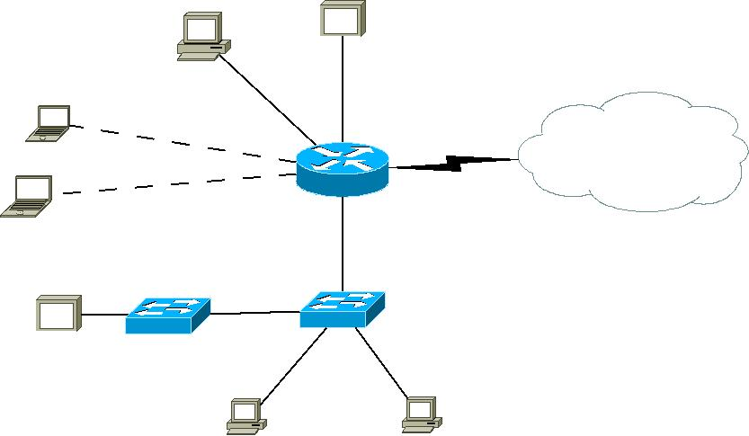
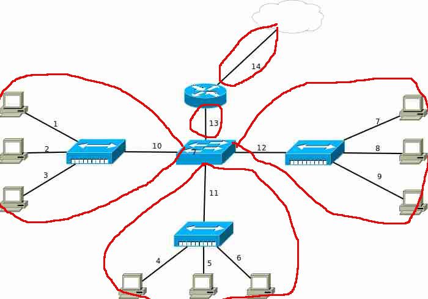
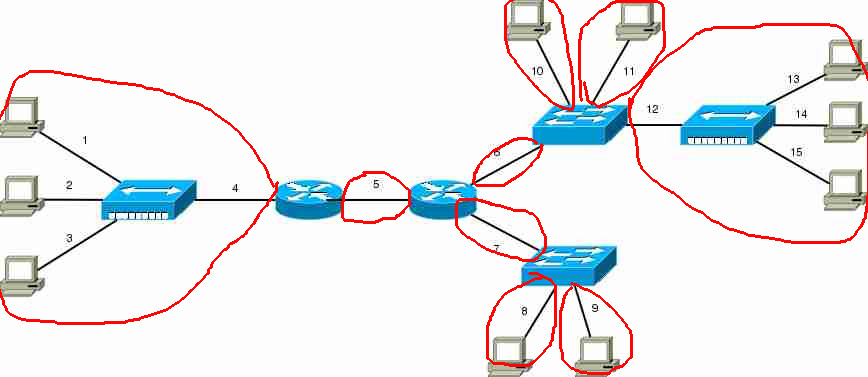
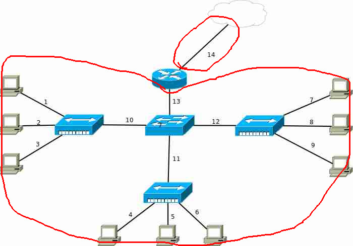
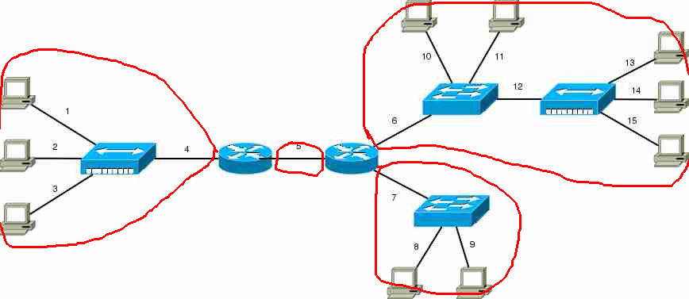
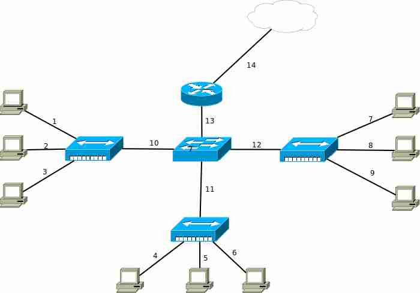
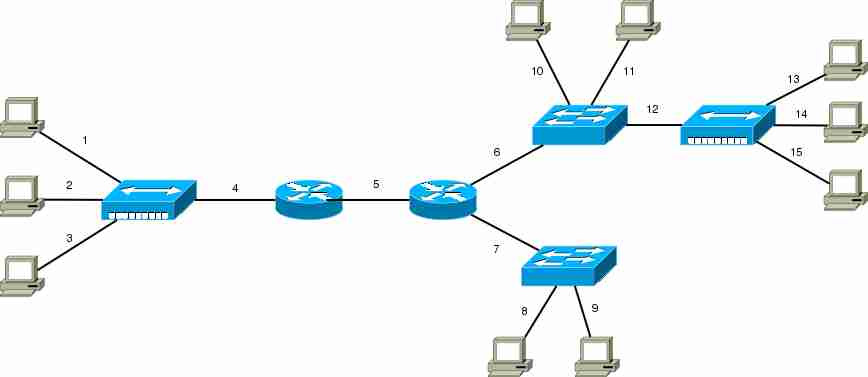

### Les xarxes d'àrea local

1. Amb el programa DIA, fes un esquema de la xarxa que tinguis a casa, a la feina o a l'escola. Quina o quines topologies de xarxa observes?

Es una tipología mixta entre la de estrella y árbol

2. Poseu-vos en grups i simuleu una xarxa amb topologia d'anell i pas de testimoni com a control d'accés al medi. Mireu aquet vídeo: [https://www.youtube.com/watch?v=50RUTSbTSR8](https://www.youtube.com/watch?v=50RUTSbTSR8)

3. Quin és el funcionament del control d'accés al medi CSMA/CD?

Los dispositivos están atentos constantemente al medio, si pueden transmitir paquetes lo hacen, y, si detectan colisiones, detienen la trasnmisión.

4. A l'aula quins dispositius de xarxa pots enumerar? Es compleixen els requisits del cablatge estructurat?

(Unos 27 o 30 ordenadores). Si, se cumplen los requisitos del cableado estructurado

5. Digues quines diferències hi ha entre un switch i un router.

 - Switch

 -Trabaja en la capa 2 del modelo OSI

 -Cuando recibe un paquete lo envía a la interfaz correspondiente, ya que conoce las direcciones MAC de las interfaces de red conectadas

 -Solo trabaja en una red local.

 - Router
 
 -Trabaja en la capa 3 del modelo OSI
 
 -Dirige los datos a través de diferentes redes

 -Usa tablas de enrutamiento para dirigir los datos

6. De cadascuna de les següents xarxes, contesta:

   - Quants dominis de col·lisió hi ha? Descriu cadascun d'aquests dominis dient quins són els trams de xarxa que els formen.

   En la imagen a, tenemos 5:

   

   En la imagen b. tenemos 9:

   

   - Quants dominis de broadcast hi ha? Descriu cadascun d'aquests dominis dient
quins són els trams de xarxa que els formen.

   En la imagen a tenemos 2:

   

   En la imagen b tenemos 4:

   

      a.

      b.

