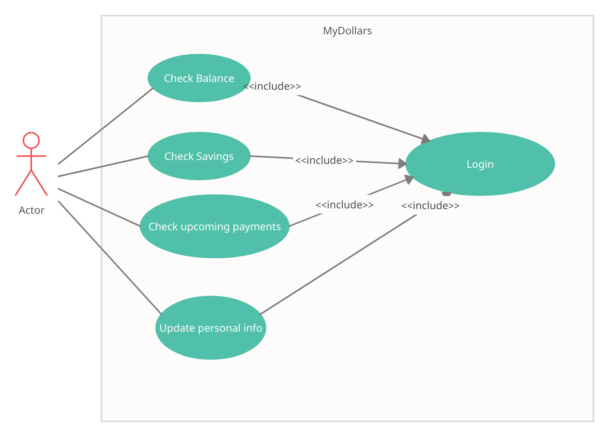
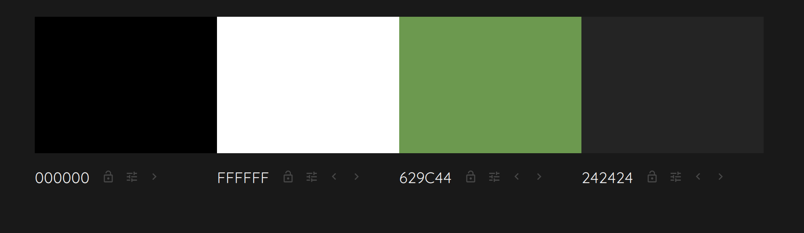
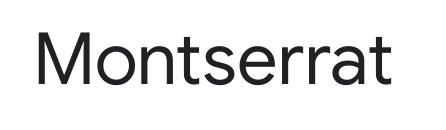
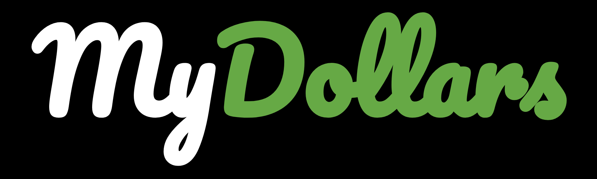

# TASCA 3. Disseny d'una App. Mockup

#### Función general de la App
Es una app de finanzas, sirve para que los usuarios puedan controlar su dinero, balances o pagos de facturas.

#### Target al que va enfocado

Va enfocado a cualquier persona que necesite hacer un control especial de su dinero, especialmente emprendedores cuyos intereses sean ver sus ahorros, estadísticas de sus gastos, etc.

#### Funcionalidades de la App

En esta App podremos ver un gráfico que muestra el balance de ingresos y gastos de nustro dinero, y el porcentaje respecto a estos, revisar pagos pendientes y revisar el saldo en las tarjetas guardadas

#### Diagrama de casos de uso

#### Guia de estilos

- Paleta de colores

Se usó la siguiente paleta de colores

La combinación de negro y blanco se escogió para darle el toque elegante y de privilegio, el verde se usa como color principal, incluso está presente en el logo, con este color se ha buscado dar una impresión de equilibrio y juventud (según la psicología de colores), además el verde se relaciona con el dinero.

- Fuente usada

Con esta fuente se busca modernizar el aspecto de la aplicación.

- Logo

#### Mockup

Se ha usó la web moqups.com, la cual no deja exportar 
https://app.moqups.com/v8E07w3Sj7/view/page/ae8fe8eb0

#### Webgrafia
Web para hacer mockup
 - moqups.com

Diseños IU de apps
 - https://dribbble.com/shots/14038579-Dark-UI-for-finance-App/attachments/5656241?mode=media
 - https://www.pinterest.com/pin/536421005610946688/

Psicología de colores
 - https://aprendizajeyvida.com/2014/02/24/el-color-verde/