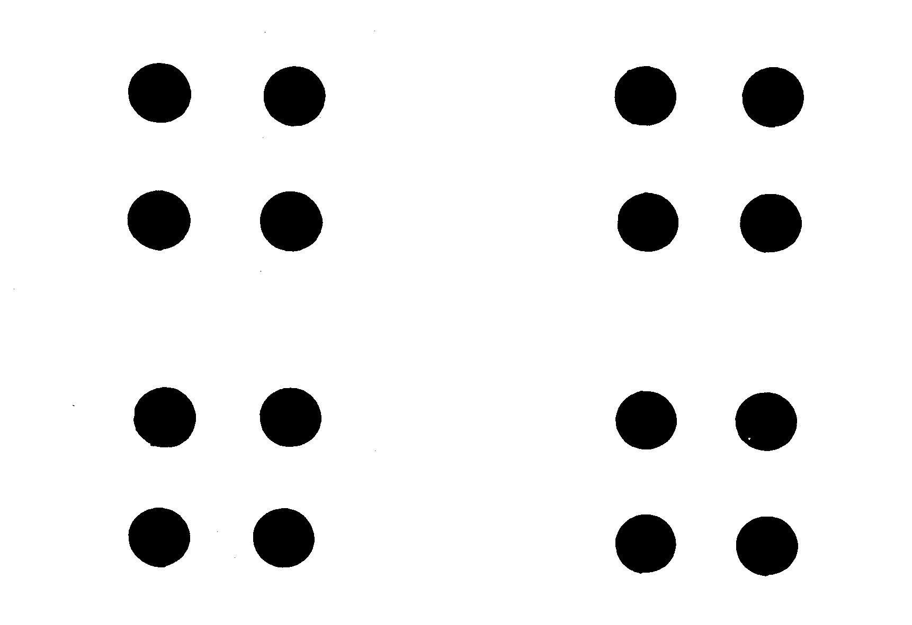
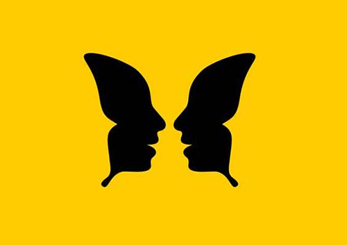
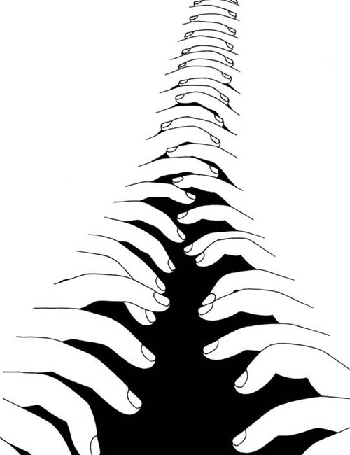
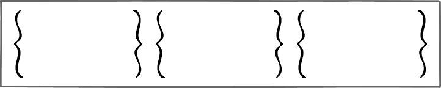
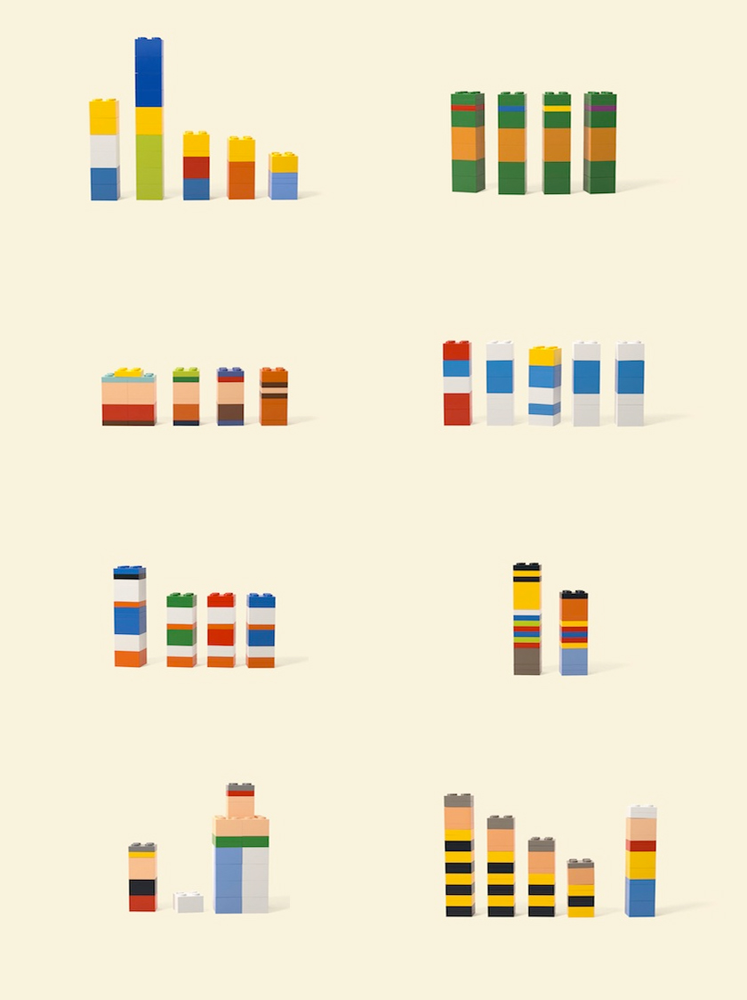

## Leyes Gestalt aplicadas al diseño de interfaces

Las **leyes Gestalt** nos ayudan a comprender como nuestra mente reacciona a los estimulos visuales de un diseño gráfico.

### Ley de la proximidad
Podemos percibir como un solo elementos a aquellos **elementos que se junten**.

### Ley de la similitud
Los objetos que **tienen una cierta similitud** se pueden llegar apercibir como un solo elementos.

### Ley de cierre
Se pueden reconocer objetos aun estando **inacabados**.

### Ley de la continuidad
Se crea una asosicación visual cuando hay elementos que se **alinean entre sí**.

### Ley fondo figura
La figura sobresale y destaca sobre su propio fondo.

### Ley de la simplicidad
El conjunto que realmente importa se presenta da la **forma más simple**, de manera que destaca.

### Ley de la simetría
Los objetos simétricos dan a entender **estabilidad**, dando una percepción **positiva**.

### Ley de la experiencia
Se aprovechan **conocimientos previos** por parte del "espectador" para dar mejor impacto al ver el diseño.
